# CloudHub

## Intro

**CloudHub** is a totally designed system that lets you monitor and manage the availability of something like servers, applications, virtual machines, Kubernetes, and so on. And this is **another branch** of an open-source web application derived from Influxdata's **_Chronograf_** written in Go and React.js that provides the tools to visualize your monitoring data and easily create alerting and automation rules.

Therefore, CloudHub has been enhanced by adding our direction, such as automation of configuration management(via **_SaltStack_ Rest API**) and monitoring the systems or applications over several Clouds.

CloudHub has been started with _Chronograf_ version **1.7.11**.

### Test Environment

For running this project, maybe, you should get the environment for test data and composition like telegraf, kapacity and influxdb (but not need chronograf).
This **_Sandbox_** provided by _sysnetsystems_ will help to do.<br>
[Download **snetsystems/sandbox**](https://github.com/snetsystems/sandbox)

For the agent management or vsphere, k8s inventory viewer test, you prepare to Salt master, api, minion.<br>
You should use [Forked **Snetsystems/salt**](https://github.com/snetsystems/salt/)<br>

For collecting data from data sources,<br>
you should use [Forked **Snetsystems/telegraf**](https://github.com/snetsystems/telegraf/releases)

## How to use Cloudhub

[Documentation for **CloudHub** Guide (in Korean)](https://seversky.atlassian.net/wiki/spaces/CSHD/overview)

## General Features
### Infrastructure
Infrastructure Topology Map authoring feature by user group.
- Status Overview of entire nodes(About CPU Temperature, CPU Memory, Disk usage, etc.).
- Show IPMI Sensor Data.
- Addable to connect to Public Cloud(AWS, GCE).
- Bare-metal Server Remote Management via **IPMI**
  <p align="center">
    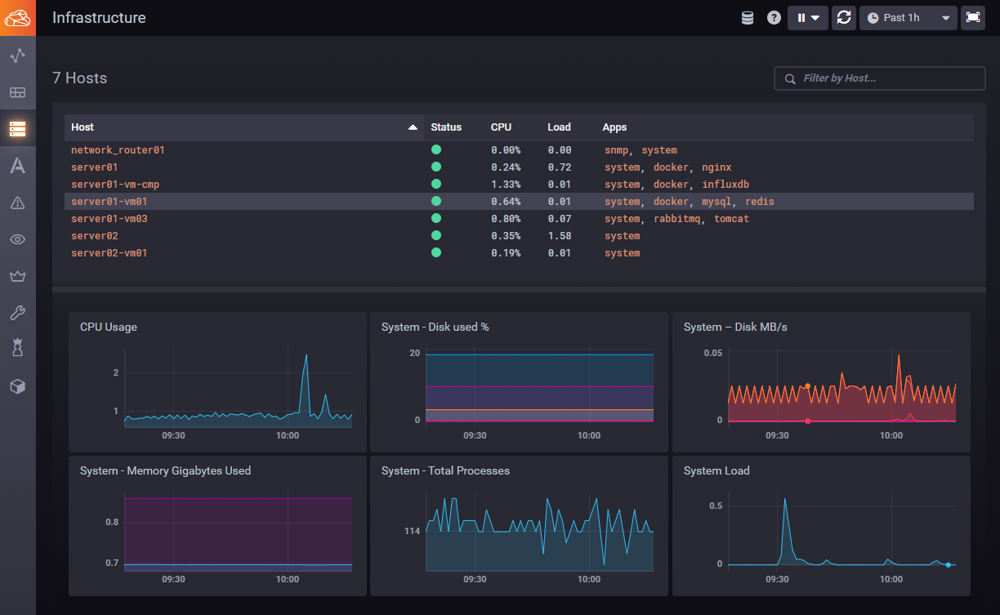
    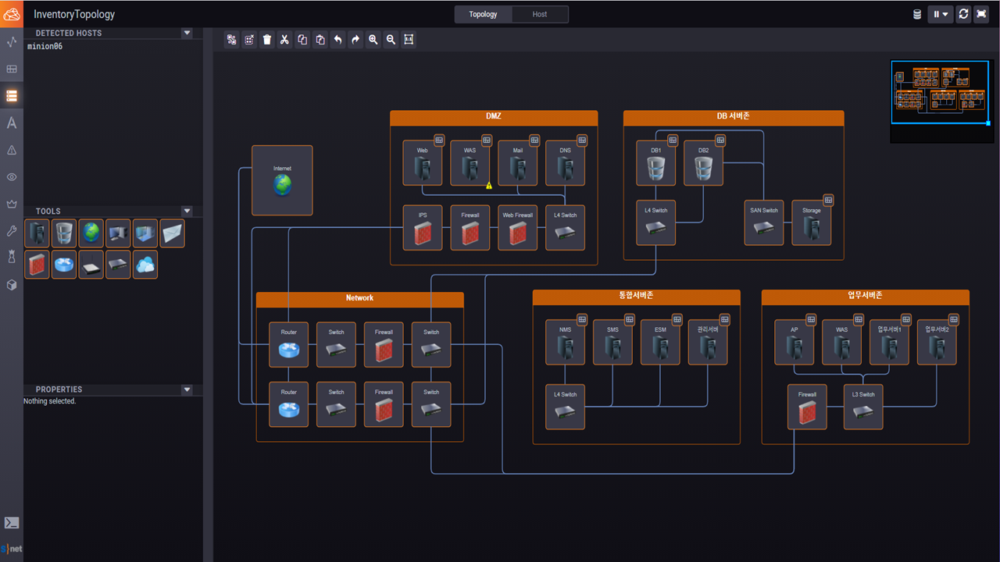
  </p>

### **Several Type Graphs** for customizable visualization
<p align="center">
  
</p>

### Telegraf agent control via **_SaltStack_**
<p align="center">
  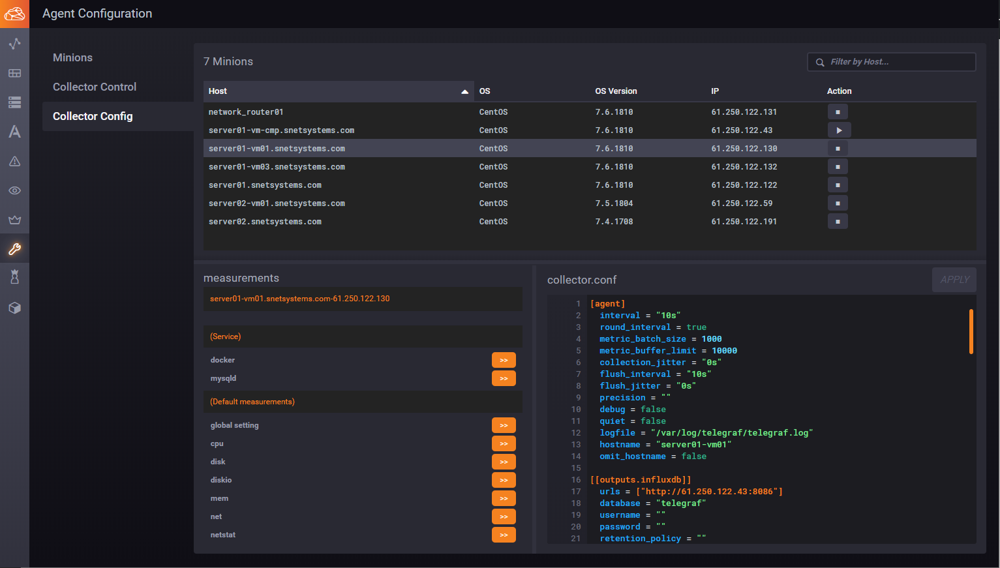
</p>

### Web SSH Terminal Console
  - Connection to hosts using ssh protocol via CloudHub WebSocket Proxy.
    <p align="center">
      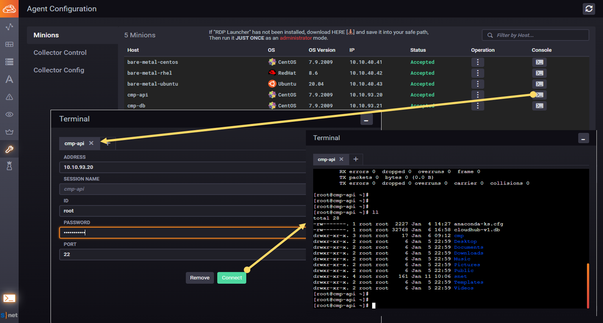
    </p>

### **_VMWare_ Infrastructure** Viewer
<p align="center">
  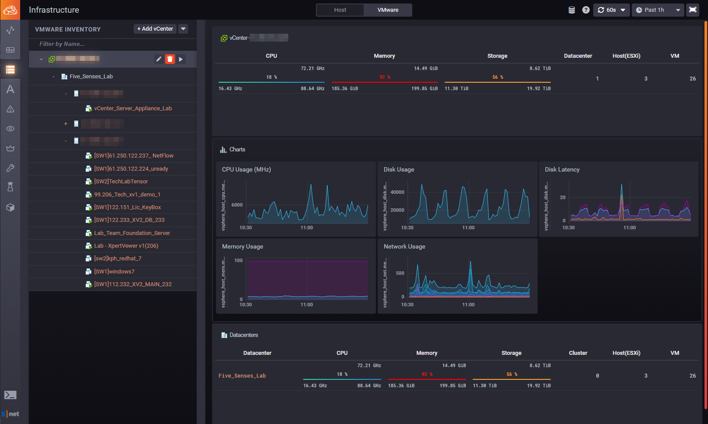
</p>

### **_OpenStack Infrastructure_** Monitoring
<p align="center">
  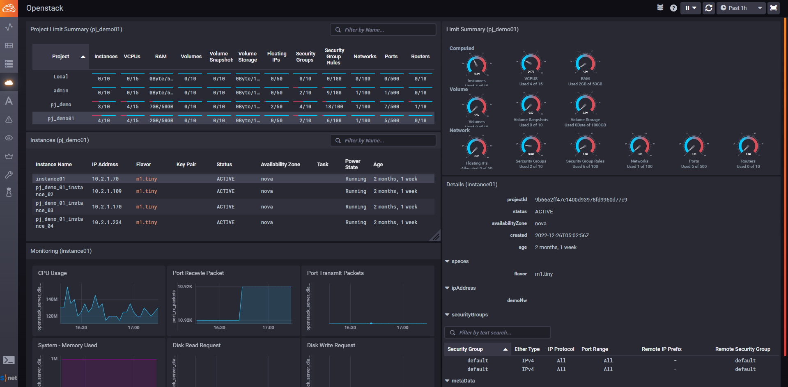
</p>

### **_K8s Infrastructure_** Diagram & Viewer
<p align="center">
  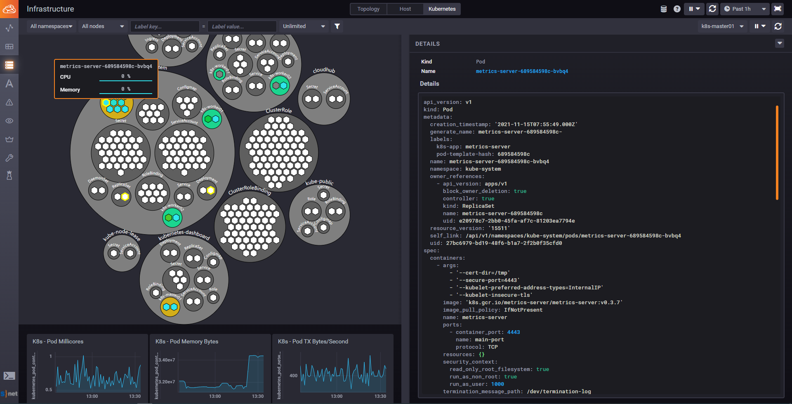
</p>

### **_AWS_** Instances Monitoring
  - Topology and Time series graphs
    <p align="center">
      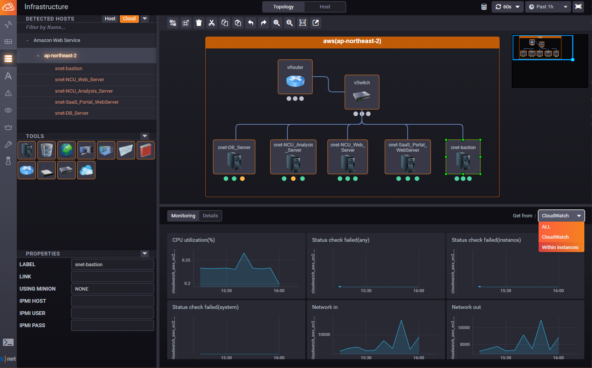
    </p>
  - Topology and Instance details
    <p align="center">
      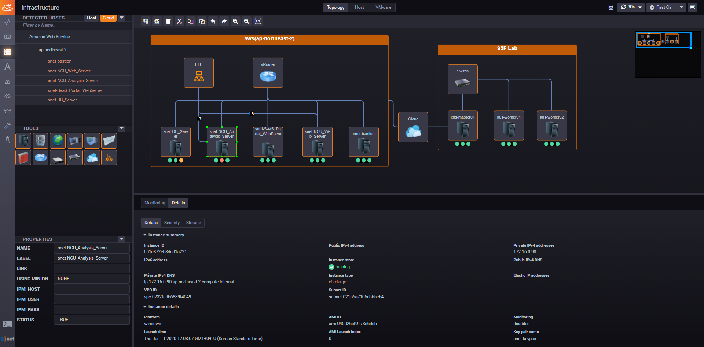
    </p>
  - Host list and Time series graphs
    <p align="center">
      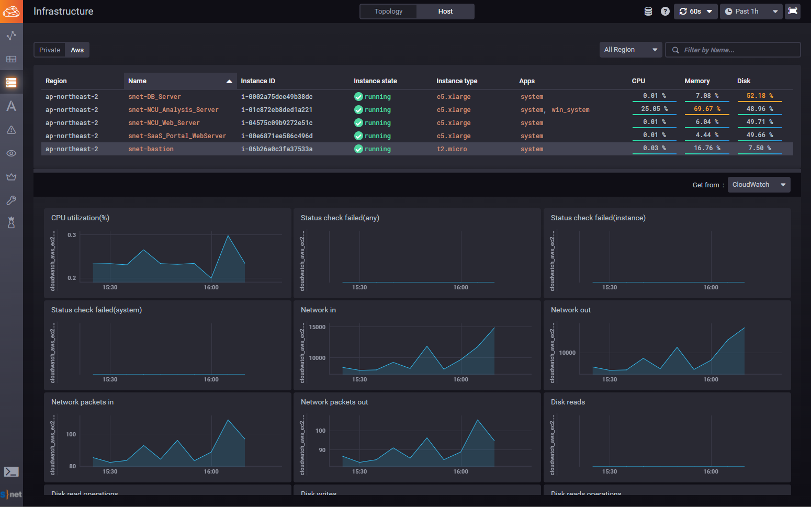
    </p>

### **_GCE_** Instances Monitoring
<p align="center">
  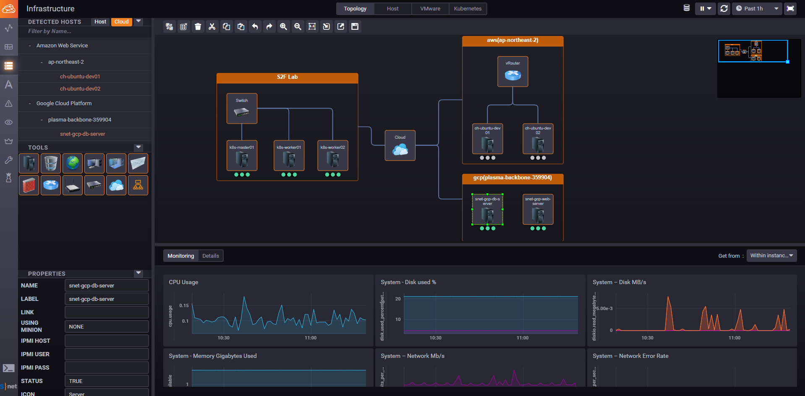
</p>

## AI Features
### Anomaly Detection for Network Device using **AI(Deep Learning)**
<p align="center">
  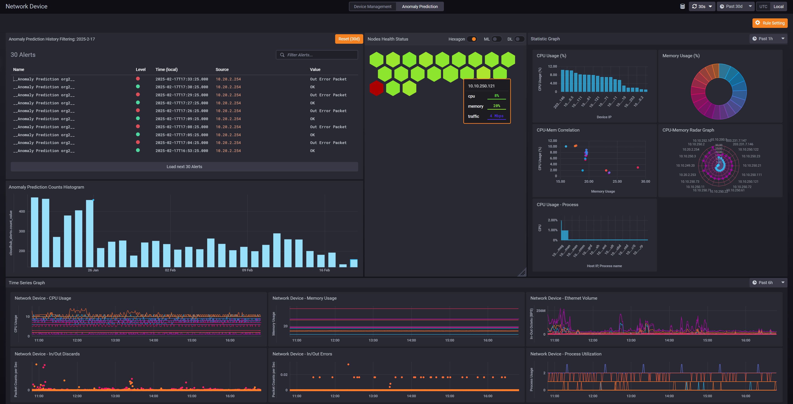
  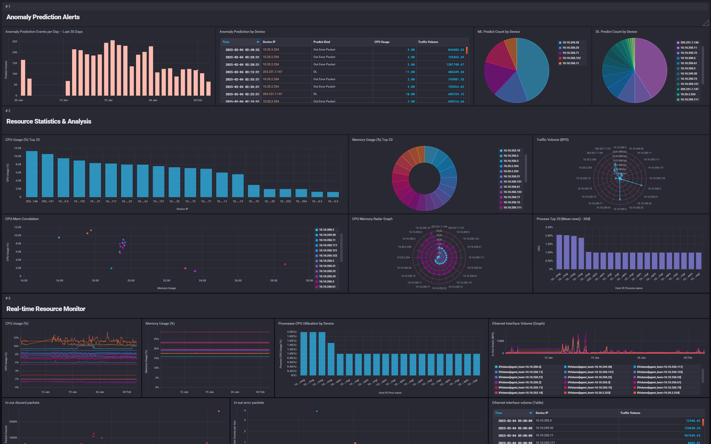
</p>
<br>

## Change log

You could know the changelog by versions via the follows.<br>
Version <= v1.2.0: [Projects(Legacy)](https://github.com/snetsystems/cloudhub/projects?query=is%3Aclosed&type=classic)<br>
Version >= v1.3.0: [Projects(Newly)](https://github.com/snetsystems?tab=projects)

## Setting in VSCode

- Add the followings into **User Setting** or **Workspace Setting**.

```json
{
  "terminal.integrated.shell.windows": "C:\\Program Files\\Git\\bin\\bash.exe",
  "terminal.integrated.rightClickBehavior": "default",
  "terminal.explorerKind": "external",
  "terminal.integrated.copyOnSelection": true,
  "terminal.integrated.scrollback": 10000,
  "breadcrumbs.enabled": true,
  "editor.renderControlCharacters": true,
  "editor.largeFileOptimizations": false,
  "editor.formatOnSave": true,
  "editor.renderWhitespace": "none",
  "editor.wordWrap": "on",
  "workbench.startupEditor": "newUntitledFile",
  "explorer.confirmDelete": false,
  "explorer.confirmDragAndDrop": false,
  "files.eol": "\n",
  "go.formatTool": "goimports",
  "go.lintOnSave": "package",
  "go.autocompleteUnimportedPackages": true,
  "prettier.singleQuote": true,
  "prettier.bracketSpacing": false,
  "prettier.semi": false,
  "prettier.trailingComma": "es5",
  "prettier.arrowParens": "avoid",
  "eslint.alwaysShowStatus": true,
  "editor.defaultFormatter": "esbenp.prettier-vscode",
  "files.associations": {
    "*.yml": "yaml"
  },
  "window.zoomLevel": 0,
  "gitlens.views.repositories.files.layout": "tree",
  "git.ignoreLegacyWarning": true,
  "screencastMode.onlyKeyboardShortcuts": true,
  "diffEditor.ignoreTrimWhitespace": false,
  "workbench.sideBar.location": "left"
}
```

## How to build

### Preparing dependencies

- CloudHub works with **go 1.21.x**, **node 12.x ~ node 14.x**, and **yarn 1.15.x ~ 1.22.x**. Thus, you have to install that according to each offcial guide.<br>
  - Yarn install example:
    ```bash
    $ npm install --global yarn@1.22.18
    ```
- Install **protoc**(protocol buffer compiler)
  - [Download here](https://github.com/protocolbuffers/protobuf/releases) proper package.
  - Unzip and then add `bin/protoc` or `bin/protoc.exe` to $PATH env. or simply put into ` $GOPATH/bin` or ` $GOROOT/bin/` diretory.
- In the case of Windows, it cannot be invoked "make" command,<br>So you need to download and install [GNUMake](http://gnuwin32.sourceforge.net/packages/make.htm) for windows.
  - [Download here](http://gnuwin32.sourceforge.net/downlinks/make.php)

### Getting the source code from github.

[If you're on Windows, run "Git Bash" and] type the followings.

```bash
# If you're on Windows, run "Git Bash" and type the followings.

$ git clone https://github.com/snetsystems/cloudhub.git
$ cd cloudhub
$ make
```

If well done, you can see the binary.

```bash
$ cd backend/cmd/cloudhub
$ ls -l
total 28072
...
-rwxr-xr-x 1 Snetsystems 197121 28610048 Jul 15 09:09 cloudhub
```

Once run cloudhub, 8888 port will be listened.

```bash
$ ./cloudhub
```

You can see the CloudHub UI via browser: http://localhost:8888

## How to debug via VSCode for Development.

Run "_cloudhub.code-workspace_" within cloudhub folder.

```bash
$ code cloudhub.code-workspace
```

Simply, select **"Launch Server"** and then run.<br>
Also, for UI debugging, select **"Launch Chrome"** and then run debug.<br>
For continuous debugging, you can use **"Launch Chrome"** after _**yarn start**_<br>

> [Note] On Windows, you have to use **"Launch Chrome"** after _**yarn start**_<br>

> [Note]<br>
> For continuous debugging, you need to add **_develop mode_** into the running argument.

> We already prepared **"_.vscode/launch.json_"** and **"_.vscode/settings.json_"**
>
> > - Using **GO111MODULE**.
> >   - Not need a vendor directory anymore.
> > - Snetsystems Github login setting as a default.
> >   - You need to change to the Github's keys of your organization.
> >   - If you don't need to login, get rid of the login information.
> >   ```json
> >    ...
> >    "args": [
> >      "-l=debug",
> >      "-d"
> >      "-c=./cloudhub-canned/",
> >      "--protoboards-path=./cloudhub-protoboards/",
> >      "--auth-duration=0",
> >      "-t=74c1e9e245088f060b5bff36b935cd0bf2976d35",
> >      "--github-client-id=c170bbdbc5cb2ea8f6d3",
> >      "--github-client-secret=55c35715b0e4eebab7edbdeef3081bf890e79d22"
> >    ],
> >    ...
> >   ```

If you run a not login mode, you can use **"Launch Chrome via Proxy"** after _**yarn start**_

```bash
$ cd $CloudHub_PATH/frontend
$ yarn start
yarn run v1.15.2
$ node parcel.jsx
Serving on http://localhost:8080
√  Built in 7.54s.
```
